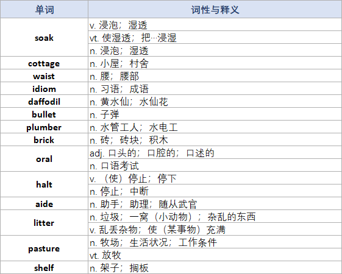

# English Word Extractor（图片英文单词提取 Skill）

一个 [WorkBuddy](https://www.workbuddy.cn) / Claude 风格的 Agent Skill：根据用户上传的图片，识别图中的英文单词，标注词性（POS）及对应中文释义，并自动生成一个排版规范的两列表格 **Excel（.xlsx）文件**。

## 功能特性

- **图片识别**：支持教材截图、单词表、英语练习题、屏幕截图等以英文单词为主的图片
- **词性 + 中文释义**：按词典规范标注词性（n. / v. / vt. / vi. / adj. / adv. / prep. / conj. / pron. / num. / art. / interj.）
- **两列表格输出**：单词在第一列，词性与释义在第二列（格式如 `n. 苹果`）
- **多词性合并单元格**：一个单词有多个词性时，单词列纵向合并；第二个及以后的词性释义依次放在第二列中、紧跟在第一个释义下方的单元格里
- **Excel 排版**：表头加粗底色、全表边框、自适应列宽、自动换行
- **去重与排序**：忽略大小写去重，按单词在图片中出现的顺序（从上到下、从左到右）排列
- **降级方案**：脚本执行失败时自动降级为 Markdown 表格输出

## 输出示例

| 单词 | 词性与释义 |
|------|-----------|
| book | n. 书；书本 |
|      | v. 预订；预约 |
| apple | n. 苹果 |

## 效果示例

### 输入图片

一张包含英文单词及其相关内容的截图（例如背单词 App 页面）：


### 输出表格

Skill 识别图中单词并生成两列表格 Excel 文件，单词列纵向合并，多词性释义依次堆叠：



## 目录结构

```
english-word-extractor/
├── assets/
│   └── examples/
│       ├── A.jpg             # 示例输入图片
│       └── B.png             # 示例输出表格
├── SKILL.md                  # Skill 定义（触发条件 + 执行流程）
└── scripts/
    └── build_word_table.py   # JSON → xlsx 表格生成脚本（依赖 openpyxl）
```

## 安装

### 方式一：手动安装（WorkBuddy）

1. 克隆或下载本仓库：

   ```bash
   git clone https://github.com/Cheering571/english-word-extractor.git
   ```

2. 将整个 `english-word-extractor` 文件夹复制到用户级 Skill 目录：

   ```
   Windows: C:\Users\<用户名>\.workbuddy\skills\english-word-extractor
   Linux/macOS: ~/.workbuddy/skills/english-word-extractor
   ```

3. 重启会话或开启新会话即可生效。

### 方式二：仅使用脚本

`scripts/build_word_table.py` 可脱离 Skill 独立使用：

```bash
pip install openpyxl
python scripts/build_word_table.py <input.json> <output.xlsx>
```

输入 JSON 格式：

```json
[
  {
    "word": "book",
    "entries": [
      {"pos": "n.", "meaning": "书；书本"},
      {"pos": "v.", "meaning": "预订；预约"}
    ]
  }
]
```

## 使用方法

安装后，在对话中上传图片并说：

- “识别图片里的英文单词”
- “帮我整理单词表”
- “extract the English words in this image”

Agent 会自动触发本 Skill：识别 → 查证词性释义 → 生成 `单词表.xlsx` → 交付文件。

## 依赖

- Python 3.8+
- [openpyxl](https://pypi.org/project/openpyxl/) >= 3.0

## License

[MIT](./LICENSE)
